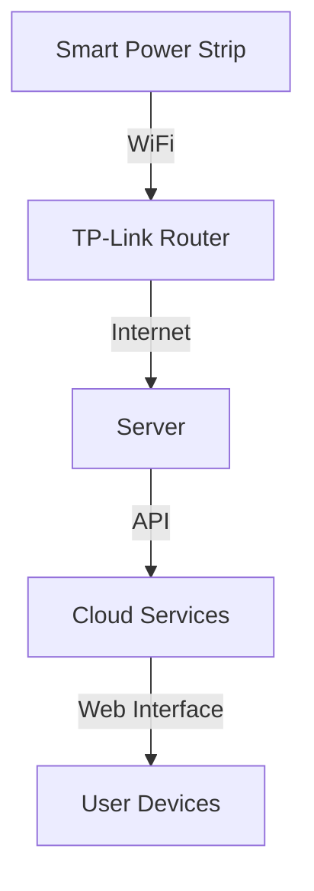

# Machine Learning Powered Electrical Scheduling - Hardware Documentation

## Hardware Components Overview

### 1. Smart Power Strip
- **Model**: TP-Link Kasa Smart Power Strip
- **Key Features**:
  - WiFi connectivity
  - Individual outlet control
  - Power monitoring
  - Surge protection
- **Power Rating**: 15A, 120V AC
- **Communication**: 2.4GHz WiFi

### 2. Network Infrastructure
- **Router**: TP-Link AC1350 Wireless Router
  - Dual-band WiFi (2.4GHz + 5GHz)
  - 4 LAN ports
  - WPA3 security

### 3. Server Hardware
- **Location**: Boston University Library
- **Type**: Desktop PC
- **Used for**: Running backend services and ML models

## System Diagrams

### Physical Layout

## Bill of Materials (BOM)

| Item | Quantity | Vendor | Part Number | Unit Cost | Total Cost |
|------|----------|---------|-------------|------------|------------|
| Kasa Smart Outlet | 1 | Amazon | KP303 | $26.00 | $26.00 |
| TP-Link AC1350 Router | 1 | Amazon | Archer A6 | $20.00 | $20.00 |
| VPS Hosting (monthly) | 1 | Hostinger | - | $18.00 | $18.00 |
| Domain Registration (yearly) | 1 | Hostinger | - | $9.00 | $9.00 |
| Data Services | 1 | Various | - | $0.25 | $0.25 |
| **Total** | | | | | **$73.25** |

## Power Requirements

### Smart Power Strip
- Input Voltage: 120V AC
- Maximum Current: 15A
- Maximum Power: 1800W
- Surge Protection: Yes
- Individual Outlet Rating: 15A

### Network Equipment
- Router Input: 12V DC, 1.5A
- Power Consumption: < 18W

## Safety Considerations

1. **Electrical Safety**
   - Do not exceed 15A total load
   - Avoid connecting high-power appliances like refrigerators
   - Keep away from water and moisture

2. **Network Security**
   - Use WPA3 encryption
   - Change default passwords
   - Regular firmware updates

## Reference Documents

### Datasheets
- [TP-Link Kasa Smart Power Strip (KP303) Datasheet](link)
- [TP-Link AC1350 Router Datasheet](link)

### Application Notes
- [Smart Home Integration Guide](link)
- [Network Setup Best Practices](link)

### Web Resources
- Kasa Smart Home: https://www.kasasmart.com
- TP-Link Support: https://www.tp-link.com/support
- Hostinger VPS Documentation: https://www.hostinger.com/tutorials/vps

## Maintenance and Support

### Regular Maintenance
1. Monthly firmware updates for smart strip
2. Router security patches
3. Network performance monitoring

### Troubleshooting
1. Power cycling procedure
2. Network connectivity issues
3. Device reset instructions

