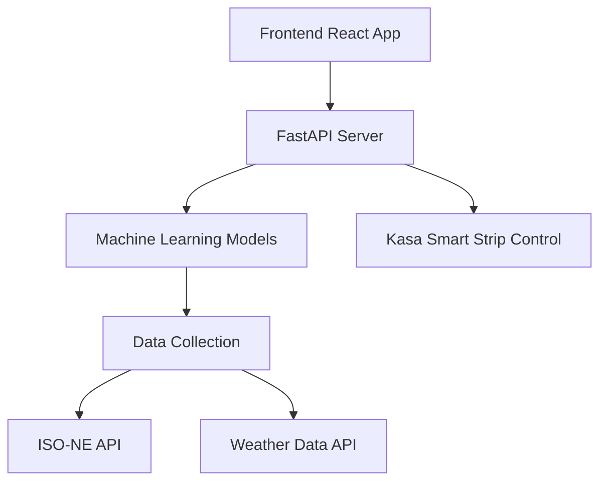

# Machine Learning Powered Electrical Scheduling - Software Documentation

## Software Module Overview

### 1. Backend Services
- **Data Collection Module** (`Working_Models/pullAllData.py`)
  - Fetches real-time energy data from ISO-NE API
  - Retrieves weather data for predictions
  - Combines data into training sets

- **Machine Learning Models** (`Working_Models/`)
  - Individual models for each energy source:
    - Hydro (`hydro_ann.py`)
    - Landfill (`landfill.py`)
    - Nuclear (`nuclear.py`)
    - Refuse (`refuse.py`)
    - Solar (`solar.py`)
    - Wind (`wind.py`)
    - Wood (`wood.py`)
  - Combined prediction model (`Working_Model.py`)

- **API Server** (`paper-dashboard/app.py`)
  - FastAPI-based REST API
  - Handles device control
  - Manages user authentication
  - Serves prediction data

### 2. Frontend Application
- **React Dashboard** (`paper-dashboard/`)
  - Real-time energy visualization
  - Device control interface
  - User authentication
  - Scheduling system

### 3. Automation
- **Data Pipeline** (`run_pull_push.sh`)
  - Automated data collection
  - Model retraining
  - Git-based deployment

## System Dependencies Flow Chart



## Development Environment

### Backend Stack
- Python 3.10
- FastAPI
- TensorFlow
- scikit-learn
- pandas
- python-kasa
- uvicorn[standard]

### Frontend Stack
- Node.js
- React 16.8+
- Chart.js 3.9.1
- Bootstrap 4.6.2
- SASS 1.62.1

### Development Tools
- Git (latest version)
- npm/Node.js
- Python virtual environment

## Installation Guide

### 1. System Requirements
- Linux/Windows/MacOS
- Python 3.10+
- Node.js 14+
- Git

### 2. Backend Setup
```bash
# Clone repository
git clone [repository-url]

# Create Python virtual environment
python -m venv .venv310
source .venv310/bin/activate  # Linux/Mac
# or
.venv310\Scripts\activate  # Windows

# Install dependencies
pip install -r requirements.txt
```

### 3. Frontend Setup
```bash
cd paper-dashboard
npm install --legacy-peer-deps
npm run build
```

### 4. Configuration
1. Set up ISO-NE API credentials in `paper-dashboard/app.py`
2. Configure Smart Strip IP in device settings
3. Set up environment variables for API keys

### 5. Running the Application
```bash
# Start backend server
uvicorn app:app --reload --port 8000

# Start frontend development server
cd paper-dashboard
npm start
```

### 6. Production Deployment
1. Build frontend:
```bash
cd paper-dashboard
npm run build
```

2. Configure web server (nginx recommended):
```nginx
server {
    listen 80;
    server_name your-domain.com;

    location / {
        root /path/to/paper-dashboard/build;
        try_files $uri $uri/ /index.html;
    }

    location /api {
        proxy_pass http://localhost:8000;
        proxy_set_header Host $host;
        proxy_set_header X-Real-IP $remote_addr;
    }
}
```

## Automated Data Pipeline

The system includes an automated data pipeline (`run_pull_push.sh`) that:
1. Pulls latest data from APIs
2. Retrains models
3. Updates predictions
4. Commits and pushes changes to GitHub

This runs on a 24-hour cycle to maintain up-to-date predictions.
